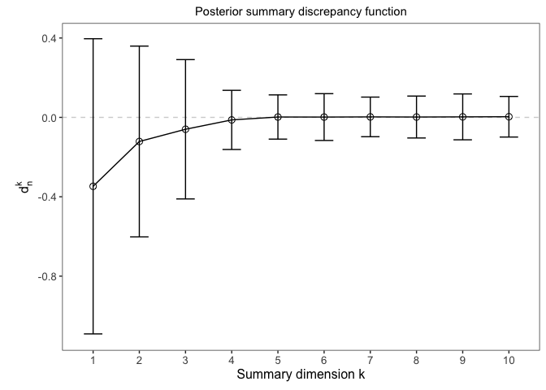
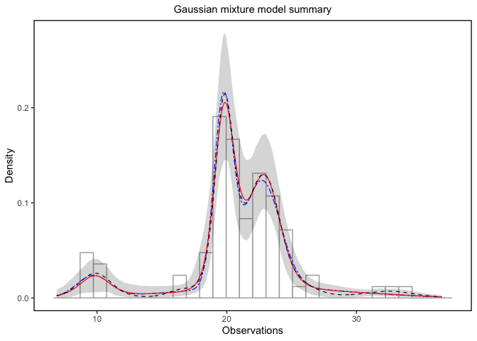
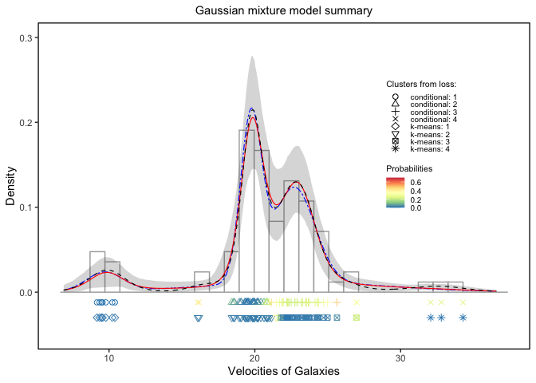

## Repository for density and cluster summaries for overparameterized Bayesian models

This repository supplements the paper “Lower-dimensional Posterior Density and Cluster Summaries for Overparameterized Bayesian Models” ([arXiv:2506.09850](https://arxiv.org/abs/2506.09850)). In this paper, we introduce a novel methodology that integrates flexible nonparametric modeling with parametric 
summarization. Specifically, we project the fit obtained from an overparameterized models, such as the Dirichlet Process Mixture Model (DPM) onto a lower-dimensional parametric surrogate, exemplified by the Gaussian Mixture Model (GMM). This projection improves interpretability while retaining the essential characteristics of the original model's fit.

This repository contains the code and a tutorial corresponding to one of the numerical examples presented in the paper.
The tutorial includes `R` code for replicating the analysis of a simple illustrative example. We outline the three-step procedure underlying our proposed method and recommend that the code be executed in the order provided. However, users may adjust parameters such as the solution path length and the width of the credible intervals in the posterior summaries as needed.

Additional scripts for reproducing the remaining numerical examples in the paper are available via the following Dropbox link.

------------------------

In the first example, we apply our methodology to the analysis of the galaxy dataset, which consists of the velocities (in $10^3$ km/s) of 82 galaxies receding from our own. These galaxies were sampled from the Corona Borealis region; for further details, see [(see Roeder, 1990)](https://www.jstor.org/stable/2289993?seq=1).

```R
# Loading the data
y.data.app = data_sim_func("galaxy")
set.seed(1800) 
```
### 1. Run the method

Necessary files:
```R
# Loading necessary files
source("source/dcpossum_dens_comp.R")
source("source/dcpossum_sim_data_mix.R")
source("source/dcpossum_plots.R")
source("source/dcpossum_unc.R")
source("source/func_pred_laplace_temp.R")
source("source/dcpossum_clust.R")
```
In this first step, we estimate the density using Dirichlet Process Mixture (DPM) models, implemented via the [`dirichletprocess`](https://cran.r-project.org/web/packages/dirichletprocess/vignettes/dirichletprocess.pdf) package. We adopt the default parameter specifications provided by the package. We then generate a sequence of Gaussian Mixture Model (GMM) summary estimates. The maximum number of components in the GMM summaries is defined as $K^{\text{max}}$, where $\boldsymbol{\hat{\gamma}}^k$ denotes the parameters of the summary. Each summary estimate is obtained by minimizing the expected loss:
$\boldsymbol{\hat{\gamma}}^k := \arg\min_{\boldsymbol{\gamma}}^k$.

```R
DPM.galaxy = dcpossum.DPM.dir(y.data.app, kmax = 10, quant.sample = 1000, 
                              k0 = 1/10, pred.f = TRUE)
```
The posterior distribution on the number of components or groups for the
Dirichlet process is given in the plot below:
```R
comp_DPM = plot_posterior_components(table(DPM.galaxy[[3]]))
```
### 2. Discrepancy function

Below is the discrepancy function plot indicating that a GMM summary
with four components provides a good approximation to the predictive
distribution of the original model under a Kullback-Leibler divergence (KL), $\text{KL}(f \| g) = \int f \log \left( \frac{f}{g} \right) dy$.

```R
DPM_comp_galaxy = plot.possum.uni(DPM.galaxy[[1]], kmax = 10, sel.K = FALSE, 
                                  y.lim = c(-1.1,0.4))
DPM_comp_galaxy
```


### 3. Posterior summarization

Below we generate the posterior summarization under a GMM surrogate with
*K*<sup>\*</sup> = 4 components.

```R
K_star = 4
possum.DPM.galaxy = possum.unc.quant.values(DPM.galaxy, K.sel = K_star)
```

### 3. Posterior density summarization plot

The plot below depicts a histogram of the galaxy data, the posterior
expected density of the original model (black-dashed line). The blue
line is a GMM with a *K*<sup>\*</sup> = 4 component summary estimate.
The grey ribbon is the 95% credible interval generated by the posterior
summary, in which the red line is the average of this summary.

```R
plots.possum.exemp.DPM = plot.possum.quant(possum.DPM.galaxy, K.sel = K_star, 
                                           scale.plot = FALSE, model = "DPM",
                                           y.data.app, index.possum = FALSE, 
                                           index.pred = "galaxy")
plots.possum.exemp.DPM$dens.summ
```


### 4. Posterior cluster summaries plot

In the plot below we display the cluster allocation estimate and posterior summary cluster allocation.

```R
possum_clust = dc.possum.clust.uni(DPM.galaxy, y.data.app, K.sel = K_star, km = TRUE)

dat.clust.DPM = process_clustering_uni(DPM.galaxy[[6]], possum_clust, K_star, y.data.app)

plot.galaxy.DPM = create_custom_plot(dat.clust.DPM,
                                     plots.possum.exemp.DPM$dens.summ,
                                     k_star = K_star, y.min.plot = -0.05, 
                                     y.max.plot = 0.3, 
                                     y.c = -0.012, y.k = -0.03, 
                                     text_plot = "Velocities of Galaxies")

p.legend <- ggdraw() +
    draw_plot(plot.galaxy.DPM) +  # Your main plot
    draw_plot(plots.possum.exemp.DPM$legend, x = 0.1, y = 0.6, 
              width = 0.25, height = 0.25) 

p.legend
```

