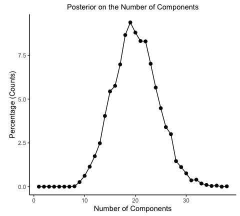
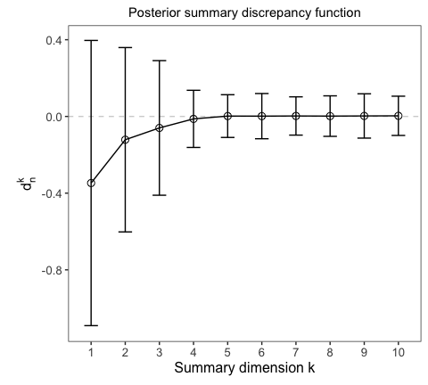
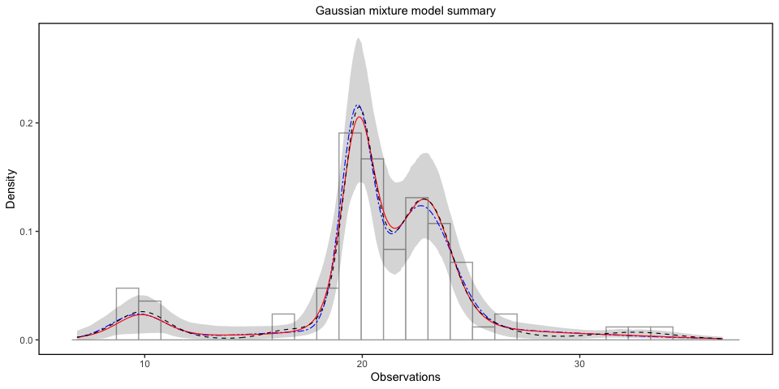
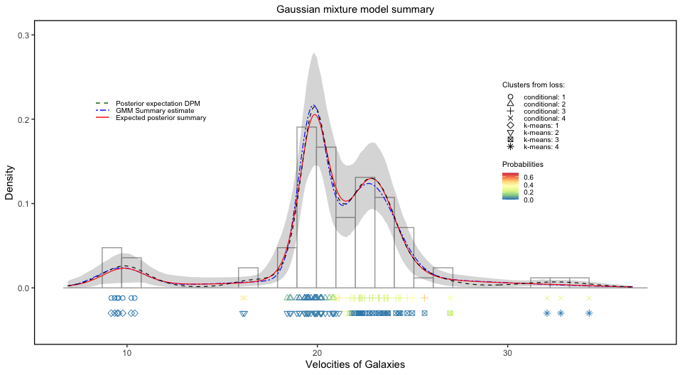
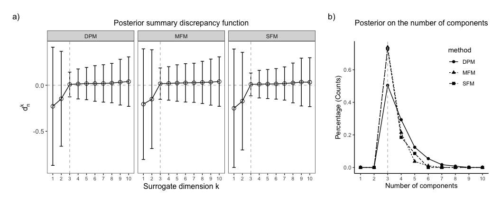
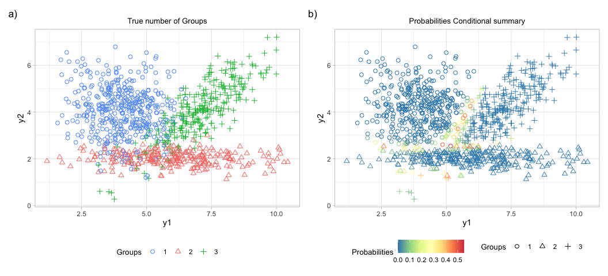
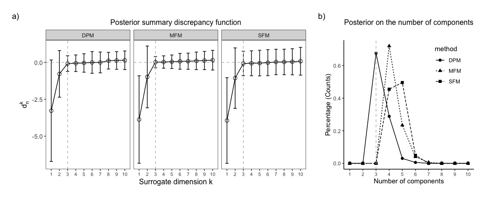
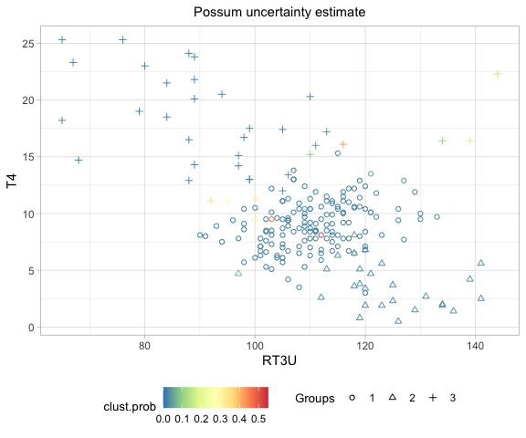

## Repository for density and cluster summaries for overparameterized Bayesian models

This repository supplements the paper “Lower-dimensional Posterior
Density and Cluster Summaries for Overparameterized Bayesian Models”
([arXiv:2506.09850](https://arxiv.org/pdf/2506.09850)). In this paper,
we introduce a novel methodology that integrates flexible nonparametric
modeling with parametric summarization. Specifically, we project the fit
obtained from an overparameterized models, such as the Dirichlet Process
Mixture Model (DPM) onto a lower-dimensional parametric surrogate,
exemplified by the Gaussian Mixture Model (GMM). This projection
improves interpretability while retaining the essential characteristics
of the original model’s fit.

The tutorial includes `R` code for replicating the analysis of a simple
illustrative example. We outline the three-step procedure underlying our
proposed method and recommend that the code be executed in the order
provided. However, users may adjust parameters such as the solution path
length and the width of the credible intervals in the posterior
summaries as needed.

------------------------------------------------------------------------

## Univariate Models - Galaxy data

In the first example, we apply our methodology to the analysis of the
galaxy dataset, which consists of the velocities (in 10<sup>3</sup>
km/s) of 82 galaxies receding from our own. These galaxies were sampled
from the Corona Borealis region; for further details, see [(see Roeder,
1990)](https://www.jstor.org/stable/2289993?seq=1).

Necessary files:

```R
# Loading necessary files
source("source/dcpossum_dens_comp.R")
source("source/dcpossum_sim_data_mix.R")
source("source/dcpossum_plots.R")
source("source/dcpossum_unc.R")
source("source/func_pred_laplace_temp.R")
source("source/dcpossum_clust.R")
```


Necessary files:

#### 1. Run the method

In this first step, we estimate the density using Dirichlet Process
Mixture (DPM) models, implemented via the
[`dirichletprocess`](https://cran.r-project.org/web/packages/dirichletprocess/vignettes/dirichletprocess.pdf)
package. We adopt the default parameter specifications provided by the
package. We then generate a sequence of Gaussian Mixture Model (GMM)
summary estimates. The maximum number of components in the GMM summaries
is defined as *K*<sup>max</sup>, where **γ̂**<sup>*k*</sup> denotes the
parameters of the summary. Each summary estimate is obtained by
minimizing the expected loss:

**γ̂**<sup>*k*</sup> := arg min<sub>**γ**<sup>*k*</sup> ∈ **Γ**<sup>*k*</sup></sub>*L*(*f̃*, *g*<sub>**γ**</sub>),  for  *k* = 1, …, *K*<sup>max</sup>
, where *f̃* is the predictive density of the DPM modelm, and
*g*<sub>**γ**</sub> is the GMM summary.

```R
# Loading the data
y.data.app = data_sim_func("galaxy")
set.seed(1800) 

# generate optimal GMM estimates under a DPM prior
DPM.galaxy = dcpossum.DPM.dir(y.data.app, kmax = 10, quant.sample = 1000, k0 = 1/10, pred.f = TRUE)
```

The posterior distribution on the number of components or groups for the
Dirichlet process is given in the plot below:

```R
# Posterior results from the DPM prior
comp_DPM = plot_posterior_components(table(DPM.galaxy[[3]]))
comp_DPM
```


#### 2. Discrepancy function

Below is the discrepancy function plot indicating that a GMM summary
with four components provides a good approximation to the predictive
distribution of the original model under a Kullback-Leibler divergence
(KL) as

$d\_{n}^k(\tilde{f}, \hat{g}\_{\boldsymbol{\gamma}}^k) = \log \frac{\hat{g}(\boldsymbol{\tilde{y}}\_n)}{\tilde{f}(\boldsymbol{\tilde{y}}\_n)}$,
where *k* = 1, …, *K*<sub>max</sub>, and *n* = 1, …, *Ñ*

```R
DPM_comp_galaxy = plot.possum.uni(DPM.galaxy[[1]], kmax = 10, sel.K = FALSE, y.lim = c(-1.1,0.4))
DPM_comp_galaxy
```


#### 3. Posterior summarization

Below we generate the posterior summarization under a GMM surrogate with
*K*<sup>\*</sup> = 4 components. This choice is based on the discrepancy
plot above. The posterior summarization is found in Section 3 of the
reference paper.

```R
K_star = 4
possum.DPM.galaxy = possum.unc.quant.values(DPM.galaxy, K.sel = K_star)
```
#### 4. Posterior density summarization plot

The plot below depicts a histogram of the galaxy data, the posterior
expected density of the original DPM model (black-dashed line). The blue
line is a GMM with a *K*<sup>\*</sup> = 4 component summary estimate.
The grey ribbon is the 95% credible interval generated by the posterior
summary, in which the red line is the average of this summary.

```R
plots.possum.exemp.DPM = plot.possum.quant(possum.DPM.galaxy, K.sel = K_star, 
                                               scale.plot = FALSE, model = "DPM",
                                               y.data.app, index.possum = FALSE, 
                                               index.pred = "galaxy")

plots.possum.exemp.DPM$dens.summ
```



#### 5. Posterior cluster summaries plot

In the plot below we display the cluster allocation estimate and
posterior summary cluster allocation. In this application, the
conditional probability allocation and k-means loss were used.

```R
# Generate posterior summarization for plots.
possum_clust = dc.possum.clust.uni(DPM.galaxy, y.data.app, K.sel = K_star, km = TRUE)

dat.clust.DPM = process_clustering_uni(DPM.galaxy[[6]], possum_clust, K_star, y.data.app)

# Generate custom plot with cluster estimates and uncertainty estimation for clusters
plot.galaxy.DPM = create_custom_plot(dat.clust.DPM, plots.possum.exemp.DPM$dens.summ,
                                        k_star = K_star, y.min.plot = -0.05, y.max.plot = 0.3, 
                                        y.c = -0.012, y.k = -0.03, text_plot = "Velocities of Galaxies")

p.legend <- ggdraw() +
      draw_plot(plot.galaxy.DPM) +  # Your main plot
      draw_plot(plots.possum.exemp.DPM$legend, x = 0.1, y = 0.6, width = 0.25, height = 0.25) 

# Display plot
p.legend
```


------------------------------------------------------------------------

## Multivariate data

Below are the complete results for the multivariate simulation scenario
proposed in our paper. They include the outcomes of our model under the
three chosen priors: DPM, MFM (mixture of finite mixtures), and SFM
(sparse finite mixture models). Here, we evaluate how our method
produces summaries for both density estimation and clustering. Details
of the data-generating process, models, sampling conditions, and
hyperparameters are provided below. Running this complete simulation
might take time (approx. 44 min.).

#### 1.Running the simulation
```R
set.seed(1822)
# Generate sample
y.data.exam.03 = data_sim_func("example_mult_03_clust", n = 1000)

# Separate data from the true cluster allocation
y.data.2 = y.data.exam.03[,c(1:2)]
y.clust = y.data.exam.03[,3]

start.time <- Sys.time()
# generate optimal GMM estimates under a MFM prior
temp.MFM.mult = dcpossum.MFM.mult(y.data.2, kmax = 10, 
                                      quant.sample = 1000, 
                                      possum.samp = 1000, f.pred = TRUE, pred.mod = "simulation")

# generate optimal GMM estimates under a DPM prior
temp.DPM.mult = dcpossum.DPM.dir.mult(y.data.2, kmax = 10,
                                      possum.samp = 1000, f.pred = TRUE, pred.mod = "simulation")

# generate optimal GMM estimates under a SFM prior
temp.SFM.mult = dcpossum.SFM.mult(y.data.2, kmax = 10, col.data = 1:2, 
                                      clust.info = 0, quant.sample = 1000, 
                                      possum.samp = 1000,
                                      post.size = 1000, f.pred = TRUE, pred.mod = "simulation")

# Number of components using the discrepancy function
comp.estim = plot.estim.comp.mult(temp.MFM.mult,temp.DPM.mult,temp.SFM.mult, sel.K = 3, title = "Discrenpancy function")

# Number of components 
comp.mult = plot.postcomp.mult(temp.DPM.mult,temp.MFM.mult,temp.SFM.mult, K.true = 3)

MFM.dens = temp.MFM.mult
DPM.dens = temp.DPM.mult
SFM.dens = temp.SFM.mult

# Plot prediction 2d
plot.pred = plot_pred_dens_mult(SFM.dens,DPM.dens,MFM.dens, y.data.2, index = "example_02", sel.K = 3, plot_density = "simulation")

# Posterior summarization for the three models
possum.SFM = possum.unc.quant.values.mult(temp.SFM.mult,K.sel = 3)
possum.DPM = possum.unc.quant.values.mult(temp.DPM.mult,K.sel = 3)
possum.MFM = possum.unc.quant.values.mult(temp.MFM.mult,K.sel = 3)

# Generate posterior summarization for the three models
plot.possum.marg = plot.possum.uncertain.quant.dc.mult(possum.SFM, possum.MFM, possum.DPM, 
                                                           K.sel = 3, y.data.2, scale.plot = FALSE,
                                                           index.possum = FALSE, quant = c(0.025,0.975), 
                                                           examp = "simulation")
end.time <- Sys.time()
time.taken <- end.time - start.time
time.taken
```
Below is the discrepancy plot for the three models, DPM, MFM, and SFM,
under the GMM surrogate (plot (a)). The plot on the right displays the
posterior on the number of components generated by the model (plot (b)).

```R
(comp.estim + comp.mult + plot_layout(widths = c(2, 1))) + plot_annotation(tag_levels = list(c("a)", "b)")))
```


Plot (a) displays the summary point estimates for the different models
generated under a GMM surrogate with *K* = 3 components. Plot (b) shows
the posterior summary estimates (red line), compared to the true
posterior expected density (dashed black line). The gray band represents
the 95% credible interval of the posterior summary surrogate.

```R
(plot.pred | plot.possum.marg) + plot_annotation(tag_levels = list(c("a)", "b)")))
```


Below we generate cluster allocations for the DPM model.
```R
optim.clust = dc.optim.clust(temp.DPM.mult, y.data.2, K.sel = 3)
possum_clust = dc.possum.clust(temp.DPM.mult, y.data.2, K.sel = 3, km = TRUE)

clust_data = data.frame(possum_clust,optim.clust = as.factor(optim.clust$optim.clust), true.clust = as.factor(y.clust))

clust_data = clust_data %>%
      mutate(rearange = case_when(
        optim.clust == 1 ~ 1,
        optim.clust == 2 ~ 2,
        optim.clust == 3 ~ 3
))
```
Plots (a) and (b) display the true cluster allocation under the
conditional probability function surrogate for the DPM model.
```R
plot.unc.clust = ggplot(clust_data ,aes(x = dat.V1, y = dat.V2, color = clust.prob, shape = as.factor(rearange))) +
      geom_point(size = 2) +
      theme_light() +
      xlab("") +
      ylab("") +
      scale_shape_manual(name = "Groups", values=c(1,2,3)) +
      theme(legend.position = "bottom", legend.title = element_text(size = 10), plot.title = element_text(size = 10, hjust = 0.5)) +
      # scale_color_distiller(palette = "Spectral", direction = -1, limits = c(0, .75))
      scale_color_distiller(name = "Probabilities", palette = "Spectral", direction = -1, limits = c(0, max(clust_data$clust.prob))) +
      labs(x ="y1", y = "y2") + #scale_shape_manual(legend_title, values = c(16, 17, 15)) +
      ggtitle("Probabilities Conditional summary")

legend_title = "Groups"
plot.true.clust = ggplot(clust_data) +
      geom_point(aes(x = dat.V1, y = dat.V2, shape = as.factor(y.clust), col = as.factor(y.clust)), size = 2) +
      theme_light() +
      theme(legend.position="bottom") +
      scale_shape_manual(name = "Groups", values=c(1,2,3)) +
      theme(legend.position = "bottom", legend.title = element_text(size = 10), plot.title = element_text(size = 10, hjust = 0.5)) +
      labs(title="True number of Groups", x ="y1", y = "y2") + #scale_shape_manual(legend_title, values = c(16, 17, 15)) +
      scale_colour_manual(legend_title, values=c("#619CFF", "#F8766D", "#00BA38"))

plot.true.clust + plot.unc.clust + plot_annotation(tag_levels = list(c("a)", "b)")))
```


We evaluated clustering performance for the different models relative to
their summaries cluster estimates using the adjusted Rand index (ARI),
which measures the agreement between true and estimated cluster
memberships. Basically, an ARI near zero corresponds to two independent
partitions, while an ARI near one indicates perfect agreement. We also
report the classification error (err) for each model, where values close
to zero reflect good classification performance.

```R
sim_Mclust = Mclust(y.data.2)

DPM.optim.clust = dc.optim.clust(temp.DPM.mult, y.data.2, K.sel = 3)
MFM.optim.clust = dc.optim.clust(temp.MFM.mult, y.data.2, K.sel = 3)
SFM.optim.clust = dc.optim.clust(temp.SFM.mult, y.data.2, K.sel = 3)

clust.MFM = data.frame(clust.MFM = temp.MFM.mult[[9]][,1000])

clust.MFM = clust.MFM %>%
      mutate(rearange = case_when(
        clust.MFM == 2 ~ 1,
        clust.MFM == 3 ~ 2,
        clust.MFM == 7 ~ 3
))
```

```R
ARI.DPM.poss = adjustedRandIndex(y.clust, DPM.optim.clust$optim.clust)
ARI.MFM.poss = adjustedRandIndex(y.clust, MFM.optim.clust$optim.clust)
ARI.SFM.poss = adjustedRandIndex(y.clust, SFM.optim.clust$optim.clust)
ARI.SFM.orig = adjustedRandIndex(y.clust, unlist(temp.SFM.mult[[9]]))
ARI.DPM.orig = adjustedRandIndex(y.clust, temp.DPM.mult[[10]])
ARI.MFM.orig = adjustedRandIndex(y.clust, clust.MFM$clust.MFM)
ARI.Mclust = adjustedRandIndex(y.clust, sim_Mclust$classification)

ARI.DPM.poss

## [1] 0.7629718

ARI.MFM.poss

## [1] 0.7386815

ARI.SFM.poss

## [1] 0.7636339

ARI.SFM.orig

## [1] 0.7518431

ARI.DPM.orig

## [1] 0.5863318

ARI.MFM.orig

## [1] 0.6301391

ARI.Mclust

## [1] 0.7600036
```

```R
class_DPM = classError(DPM.optim.clust$optim.clust, y.clust)$errorRate
class_MFM = classError(MFM.optim.clust$optim.clust, y.clust)$errorRate
class_SFM = classError(SFM.optim.clust$optim.clust, y.clust)$errorRate
class_SFM_T = classError(unlist(temp.SFM.mult[[9]]), y.clust)$errorRate
class_MFM_T = classError(clust.MFM$clust.MFM, y.clust)$errorRate
class_DPM_T = classError(temp.DPM.mult[[10]], y.clust)$errorRate
class_Mclust_T = classError(sim_Mclust$classification, y.clust)$errorRate

class_DPM

## [1] 0.085

class_MFM

## [1] 0.094

class_SFM

## [1] 0.085

class_SFM_T

## [1] 0.089

class_MFM_T

## [1] 0.142

class_DPM_T

## [1] 0.167

class_Mclust_T

## [1] 0.086
```
------------------------------------------------------------------------

#### 2. Tyroid data

The thyroid dataset is a widely used benchmark for analyzing
multivariate normal mixtures. It consists of five laboratory test
variables and a categorical variable indicating the diagnostic outcome
for a total of 215 patients. The diagnostic outcome contains three
possible scenarios that are the clusters of interest. %This dataset is
available in the `mclust` package.

We evaluated the data using the same models, DPM, MFM, and SFM. We
generated a sample of size *Ñ* = 2000 from the posterior predictive
distribution *f̃* for all models. We constructed summary estimates using
finite mixture models summaries with Gaussian kernels, in all cases. The
number of components in the finite mixture model summary were selected
based on the discrepancy function, *d*<sub>*n*</sub><sup>*k*</sup>.
```R
set.seed(12345)
y.data.thyroid = data_sim_func("thyroid")
y.data.clust = data_sim_func("thyroid_clust")

start.time <- Sys.time()
temp.MFM.mult = dcpossum.MFM.mult(y.data.thyroid, kmax = 10, quant.sample = 1000,
possum.samp = 1000)

temp.DPM.mult = dcpossum.DPM.dir.mult(y.data.thyroid, kmax = 10,
possum.samp = 1000, f.pred = TRUE)

temp.SFM.mult = dcpossum.SFM.mult(y.data.thyroid, kmax = 10, col.data = 1:5,
clust.info = 0, quant.sample = 1000, post.size = 1000)

# Discrepancy plot
comp.estim = plot.estim.comp.mult(temp.MFM.mult,temp.DPM.mult,temp.SFM.mult, title = "Discrenpancy function", sel.K = 3)

# Comparing posterior on the number of components
comp.model = plot.postcomp.mult(temp.MFM.mult,temp.DPM.mult,temp.SFM.mult, K.true = 3)

possum_clust_SFM = dc.possum.clust(temp.SFM.mult, y.data = y.data.thyroid, K.sel = 3, km = FALSE)
optim.clust_SFM = dc.optim.clust(temp.SFM.mult, y.data.thyroid, K.sel = 3)
```

Plot (a) displays the discrepancy plots, revealing that a Gaussian
summary with three, *k* = 3, provides a reasonable approximation for the
predictive posterior of the DPM, MFM, and SFM models. This conclusion is
supported by the average value of the discrepancy function,
*d̄*<sub>*n*</sub><sup>*k*</sup>, defined in , being near zero in all
cases. Additionally, the variability associated with the discrepancy
function, sd(*d*<sub>*n*</sub><sup>*k*</sup>), increases substantially
for summaries with *k* &lt; 3 components. Figure (b) displays the
posterior distribution of the number of components from the original
posteriors.
```R
(comp.estim + comp.model + plot_layout(widths = c(2, 1))) + plot_annotation(tag_levels = list(c("a)", "b)")))
```

We generated cluster allocations and uncertainty estimates for the SFM
model with *K*<sup>\*</sup> = 3, using conditional probability
allocation summary. Figure (a) presents the true cluster allocation with
respect to the variables T4 and RT3U. Plot (b) shows the optimal cluster
allocation summary with *K*<sup>\*</sup> = 3 components, generated under
the SFM posterior predictive distribution, using the conditional
probability allocation loss.

```R
clust.data.SFM = data.frame(possum_clust_SFM, clust.SFM = optim.clust_SFM$optim.clust)

SFM.possum.clust = ggplot(clust.data.SFM) +
geom_point(aes(x = dat.RT3U,y = dat.T4, col = clust.prob, shape = as.factor(clust.SFM)), size = 1.5) +
scale_color_distiller(palette = "Spectral", direction = -1, limits = c(0, 0.55)) +
theme_light() +
scale_shape_manual(name = "Groups", values=c(1,2,3)) + 
theme(legend.position = "bottom", legend.title = element_text(size = 10), plot.title = element_text(size = 11, hjust = 0.5)) +
labs(title = "Possum uncertainty estimate", x = "RT3U", y = "T4")

legend_title <- "Groups"
category_mapping <- c("Normal" = 2, "Hypo" = 1, "Hyper" = 3)
transformed_data <- thyroid %>%
mutate(Category_Numeric = recode(Diagnosis, !!!category_mapping))

true_clust = ggplot(transformed_data) +
geom_point(aes(x = RT3U, y = T4, shape = as.factor(Category_Numeric), col = as.factor(Category_Numeric)), size = 1.5) +
theme_light() +
theme(legend.position="bottom") +
scale_shape_manual(name = "Groups", values=c(2,1,3)) + 
labs(title="True", x ="RT3U", y = "T4") + #scale_shape_manual(legend_title, values = c(16, 17, 15)) +
theme(legend.position = "bottom", legend.title = element_text(size = 10), plot.title = element_text(size = 11, hjust = 0.5)) +
scale_colour_manual(legend_title, values=c("#619CFF", "#F8766D", "#00BA38"))

true_clust + SFM.possum.clust + plot_annotation(tag_levels = list(c("a)", "b)")))
```



```R
ARI.SFM.orig = adjustedRandIndex(transformed_data$Category_Numeric, unlist(temp.SFM.mult[[9]]))
class_SFM_orig = classError(transformed_data$Category_Numeric, unlist(temp.SFM.mult[[9]]))$errorRate

mclust.thy = Mclust(y.data.thyroid)
class_mclust_orig = classError(mclust.thy$classification, transformed_data$Category_Numeric)$errorRate
mclust.thy_orig = adjustedRandIndex(transformed_data$Category_Numeric, mclust.thy$classification)

ARI.SFM.poss = adjustedRandIndex(transformed_data$Category_Numeric, optim.clust_SFM$optim.clust)
class_SFM_poss = classError(transformed_data$Category_Numeric, optim.clust_SFM$optim.clust)$errorRate
```
SFM original cluster estimate

```R
ARI.SFM.orig

## [1] 0.8826543

class_SFM_orig

## [1] 0.05581395

Mclust summary estimate

mclust.thy_orig

## [1] 0.8771483

class_mclust_orig

## [1] 0.0372093

SFM summary cluster estimate

ARI.SFM.poss

## [1] 0.907901

class_SFM_poss

## [1] 0.02790698
```
------------------------------------------------------------------------
